# Locus

    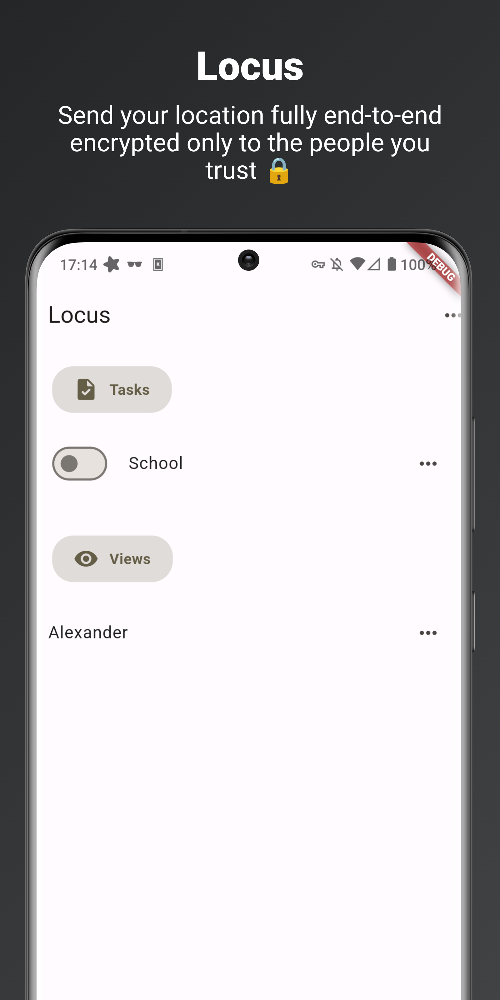
    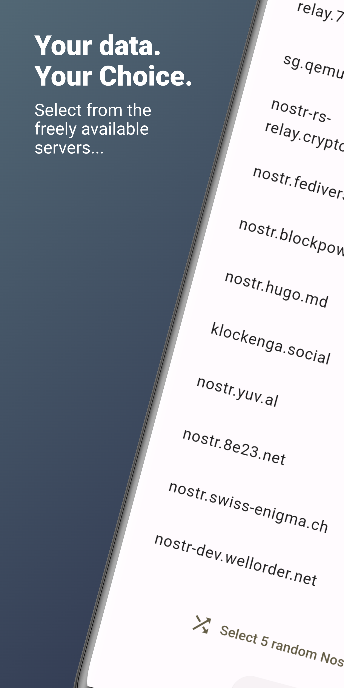
    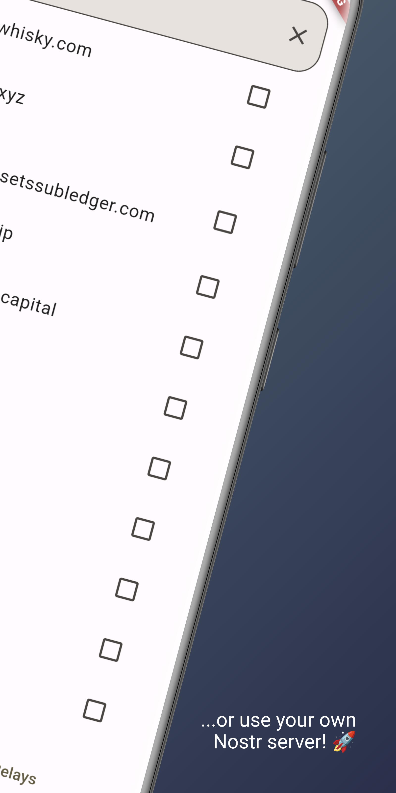

    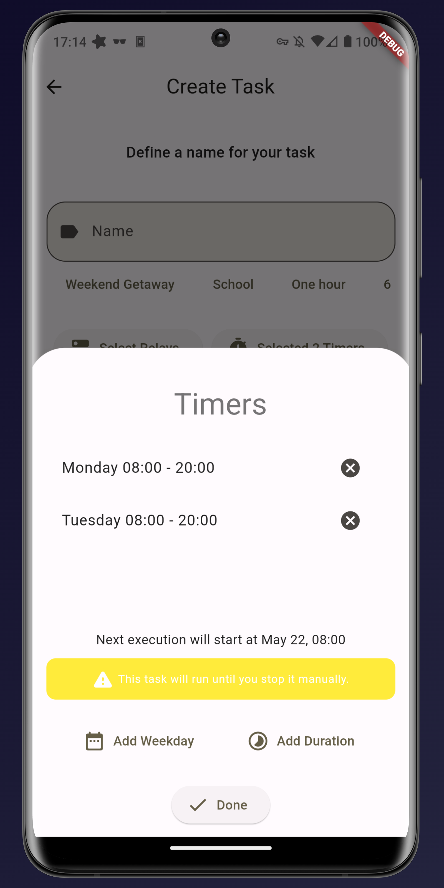
    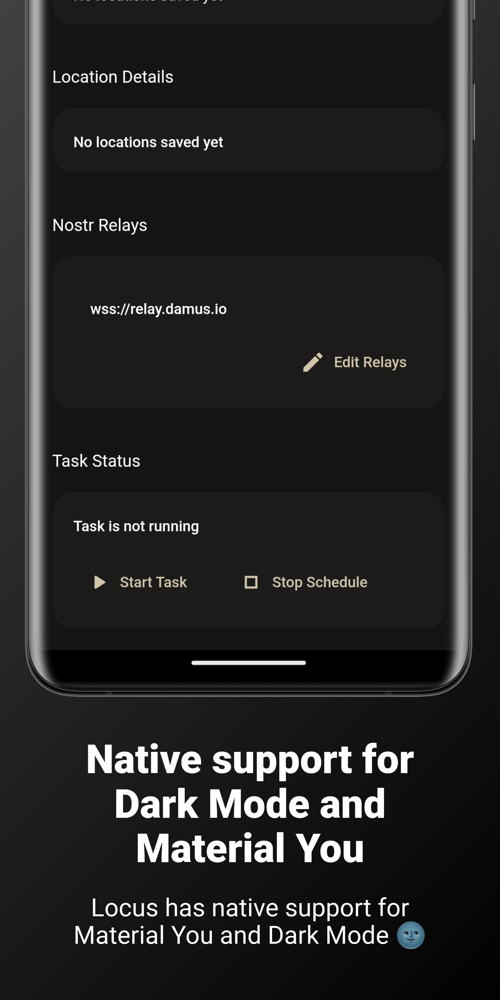
    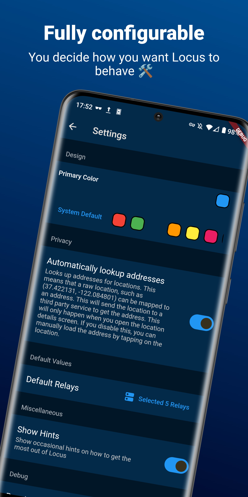
    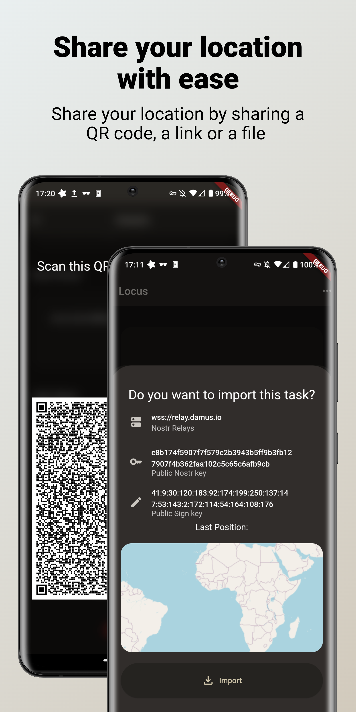

    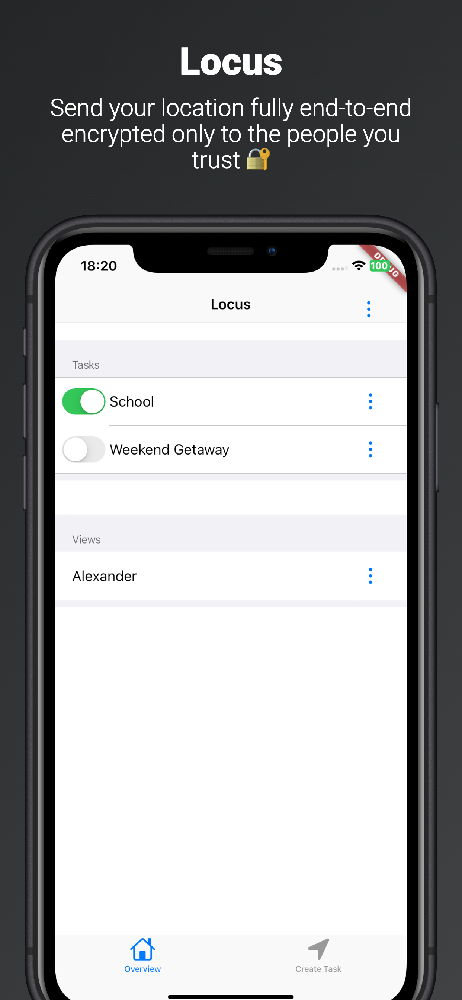
    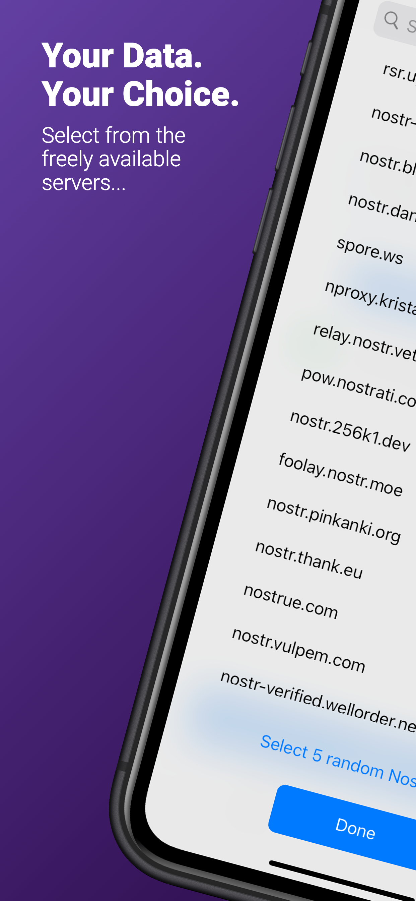
    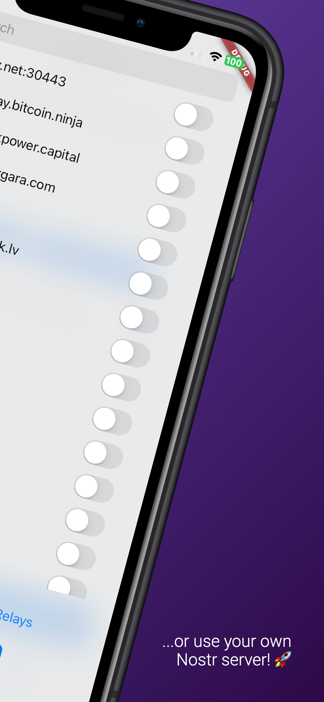

    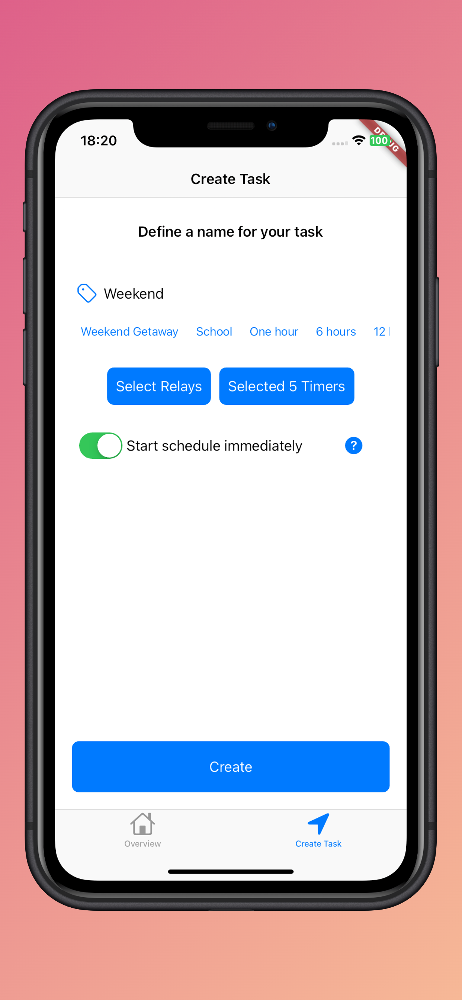
    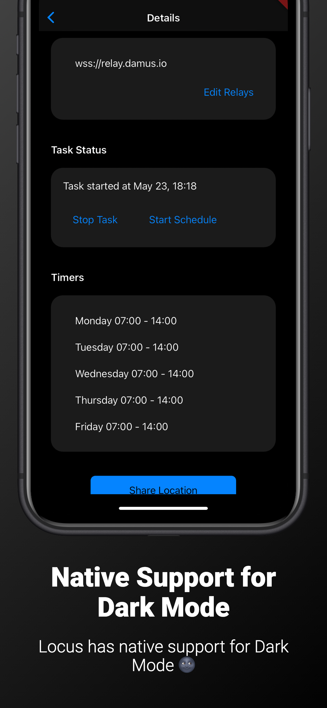
    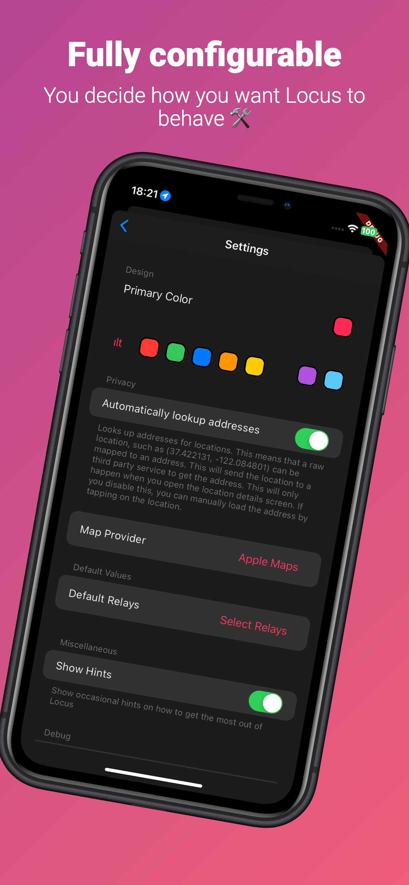
    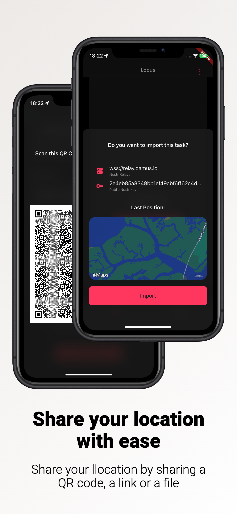

Locus is a free, open source app for Android and iOS that allows you to share your location live. It
encrypts your location end-to-end, meaning that no one, not even we, can read it. It stores the
location decentralized on multiple servers of your choice using Nostr, meaning that you are not
locked to a service. No authentication required.

# Download

A community member has provided Locus builds for iOS [here](https://jbmagination.com/locus-ios).

Locus comes in two variants for Android:

* GMS: This variant uses Google Play Services to get your location. **If you have Google Play Services
  installed**, you **must use** this variant. F-Droid uses this version
* FLOSS: This variant is completely libre and does not use any proprietary software. If you have **NO
  Google Play Services installed**, you **must use** this variant.

When downloading from GitHub, you can choose from both options.

# Supporting Locus

You can support Locus in various ways:

## Contribute to the project

Add a new feature or fix bugs.

## Add translations

Translate Locus into your language so that other people can use it more easily.

## Donate

It might sound crazy, but if you would just donate 1$, it would totally mean to world to me, since
it's a really small amount and if everyone did that, I can totally focus on Locus and my other open
source projects. :)

You can donate via:

* [GitHub Sponsors](https://github.com/sponsors/Myzel394)
* Bitcoin: `bc1qw054829yj8e2u8glxnfcg3w22dkek577mjt5x6`
*

Monero: `83dm5wyuckG4aPbuMREHCEgLNwVn5i7963SKBhECaA7Ueb7DKBTy639R3QfMtb3DsFHMp8u6WGiCFgbdRDBBcz5sLduUtm8`
